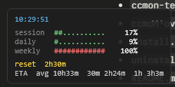

<div align="center">

# ccmon

**Compact, always-on-top desktop overlay for Claude Code token usage.**

[](#requirements)
[](#requirements)
[](LICENSE)



*Session, daily and weekly usage as % bars. ETA to exhaust the current 5h block at three different burn rates.*

</div>

---

## Why

Claude Code's usage dashboard lives behind a few clicks in the browser. ccmon puts the numbers you care about on your desktop — borderless, draggable, semi-transparent, refreshing every 30s, never blocking the UI.

## Features

- **3 bars**: session block (5h), daily total, weekly total
- **ETA**: time to exhaust the session limit at avg / last 30 min / last 1 h burn rate
- **Auto-calibration**: limits default to your previous personal max (no config needed)
- **Override limits**: env vars for real Anthropic plan caps
- **Async refresh**: background runspace fetches data — overlay stays responsive
- **Persistent position**: remembers where you placed it
- **Two flavors**: WPF overlay (default) or terminal mode (pinnable to taskbar)

## Preview

```
┌─────────────────────────────────┐
│ 14:23:01                  ccmon │
│                                 │
│ session  ##########..    64%    │
│ daily    #####.......    31%    │
│ weekly   ##........... ▌ 14%    │
│                                 │
│ reset  2h47m                    │
│ ETA  avg 12h0m  30m 3h3m  1h 5h │
└─────────────────────────────────┘
```

Bars: <kbd>green</kbd> < 50% · <kbd>yellow</kbd> 50–80% · <kbd>red</kbd> ≥ 80%.

## Requirements

| | |
|---|---|
| OS | Windows 10 / 11 |
| PowerShell | 5.1 (preinstalled) or 7+ |
| Node.js | 18+ (`npx` runs [`ccusage`](https://www.npmjs.com/package/ccusage) under the hood) |

## Install

```powershell
git clone https://github.com/acker241/ccmon.git
cd ccmon
powershell -ExecutionPolicy Bypass -File install.ps1
```

Add `-Startup` to also launch on Windows boot:

```powershell
powershell -ExecutionPolicy Bypass -File install.ps1 -Startup
```

Files land in `%LOCALAPPDATA%\ccmon`. A shortcut is created on your Desktop.

## Run

Double-click `Desktop\ccmon-overlay.lnk`. First launch downloads `ccusage` (~10s).

| Interaction | Effect |
|---|---|
| Left-click + drag | Move window |
| Right-click | Context menu — switch metric, check for updates, close |
| <kbd>Esc</kbd> | Close |

### Context menu

- **Metric**
  - **USD (cost)** — bars/limits in dollars (Anthropic dashboard alignment)
  - **Tokens (raw)** — bars/limits in token sums
  - **Percentage (auto)** — auto-calibrated against personal max, ignores env vars *(default)*
- **Check for updates** — pings GitHub for new commits; status shows `↑` if available
- **Open GitHub repo**
- **Close**

Preferences saved to `~\.ccmon-config.json`.

Terminal mode (alternative, pin to taskbar):

```powershell
powershell -File "$env:LOCALAPPDATA\ccmon\ccmon-terminal.ps1"
```

## Configure plan limits

ccmon measures usage in **USD cost** (mirrors Anthropic's dashboard weighting — cache reads, output multipliers, etc. all priced in). By default bars calibrate against your **previous personal max** in USD (current period excluded — so 100% genuinely means "you've broken your record"). To show real % against your Anthropic plan caps instead, set these env vars (values in USD, e.g. `108.59`):

```powershell
[Environment]::SetEnvironmentVariable('CCMON_SESSION_LIMIT', '109',  'User')
[Environment]::SetEnvironmentVariable('CCMON_DAILY_LIMIT',   '840',  'User')
[Environment]::SetEnvironmentVariable('CCMON_WEEKLY_LIMIT',  '5880', 'User')
```

Restart the overlay after setting.

### Auto-calibrate

The included `calibrate.ps1` does it for you. Open https://claude.ai/settings/usage in your browser, then:

```powershell
powershell -ExecutionPolicy Bypass -File "$env:LOCALAPPDATA\ccmon\calibrate.ps1"
```

It fetches your current USD cost via ccusage, prompts for the % the dashboard shows, computes `limit_usd = cost_usd / pct` for each bar, and writes the env vars. With USD-based metric drift is minimal — calibrating once usually lasts months.

### Manual derivation

```
limit_usd = current_cost_usd / dashboard_pct
```

Where `current_cost_usd` comes from:

```powershell
npx ccusage blocks --active --json   # session (costUSD)
npx ccusage daily --json             # daily (totalCost — not on dashboard, estimate weekly/7)
npx ccusage weekly --json            # weekly (totalCost)
```

## Uninstall

```powershell
powershell -ExecutionPolicy Bypass -File "$env:LOCALAPPDATA\ccmon\uninstall.ps1"
```

Removes installed files, shortcuts, and saved overlay position.

## How it works

- `ccusage blocks/daily/weekly --json` provides aggregated token totals
- ccmon parses `~/.claude/projects/**/*.jsonl` directly to compute windowed burn rates (last 30 min, last 1 h) — ccusage doesn't expose those windows
- ETA = `(session_limit − session_used) / rate_tokens_per_minute`
- Overlay is a borderless transparent WPF window built from XAML inside PowerShell
- Background work runs in a separate `[PowerShell]` runspace; a 200 ms dispatcher timer marshals results back to the UI thread when ready

## Notes

- **Weekly may exceed 100%** when your current week is a new personal record. Set `CCMON_WEEKLY_LIMIT` to fix the ceiling to your actual plan cap.
- **Bars are USD-based** — same currency as Anthropic's pricing, so the dashboard's % and ccmon's % stay in sync regardless of how your cache-read / output mix changes.
- Fetch cost ≈ 6–8 s per refresh (3 ccusage calls + JSONL scan). Runs in background — overlay stays smooth. **Zero Claude API tokens consumed** — ccusage only reads local files.

## License

[MIT](LICENSE)
